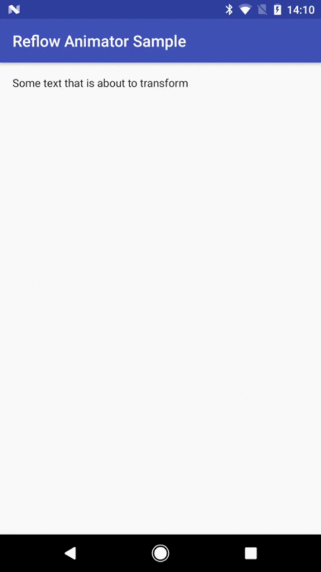

Reflow Text Animator
======

A port of [Plaid's ReflowText](https://github.com/nickbutcher/plaid/blob/master/app/src/main/java/io/plaidapp/ui/transitions/ReflowText.java) that allows easily transitioning between sibling TextViews - no matter their size or style.



Usage
------

To move and transform `fromView` into `toView`:

```java
new ReflowTextAnimatorHelper.Builder(fromView, toView)
    .buildAnimator()
    .start();
```

_Note that both views need to have been laid out when passing them in the `Builder`. Depending on your implementation, this might have to be wrapped in an `OnPreDrawListener`._

---
Have a look at [the sample](https://github.com/shazam/reflow-animator/tree/master/sample) for a more complete implementation! 


Download
--------

Snapshot
```gradle
repositories {
    maven { url 'https://oss.sonatype.org/content/repositories/snapshots' }
}

dependencies {
    implementation 'com.shazam:android-reflow-animator:1.0.0-SNAPSHOT'
}
```


License
------
    Copyright 2017 Shazam Entertainment Limited.

    Licensed under the Apache License, Version 2.0 (the "License");
    you may not use this file except in compliance with the License.
    You may obtain a copy of the License at

       http://www.apache.org/licenses/LICENSE-2.0

    Unless required by applicable law or agreed to in writing, software
    distributed under the License is distributed on an "AS IS" BASIS,
    WITHOUT WARRANTIES OR CONDITIONS OF ANY KIND, either express or implied.
    See the License for the specific language governing permissions and
    limitations under the License
